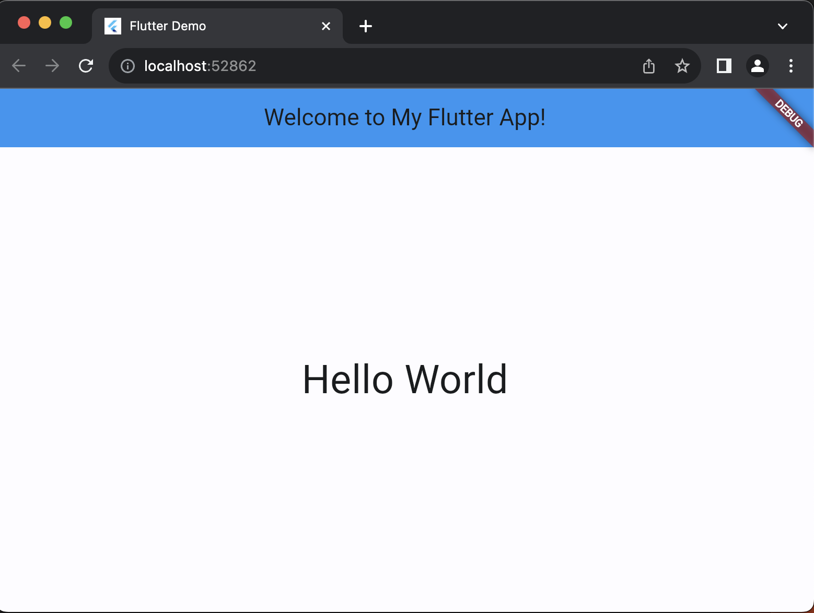

# Flutter : Project Hello World

#### &#x1F530; BEGIN :

    ❯ flutter create project_helloworld

            Creating project project_helloworld...
            Resolving dependencies in project_helloworld... (1.2s)
            Got dependencies in project_helloworld.
            Wrote 129 files.

            All done!
            You can find general documentation for Flutter at: https://docs.flutter.dev/
            Detailed API documentation is available at: https://api.flutter.dev/
            If you prefer video documentation, consider: https://www.youtube.com/c/flutterdev

            In order to run your application, type:

            $ cd project_helloworld
            $ flutter run

            Your application code is in project_helloworld/lib/main.dart.

    ❯ cd project_helloworld

    ❯ flutter run

            Connected devices:
            macOS (desktop) • macos  • darwin-arm64   • macOS 13.3.1 22E261 darwin-arm64
            Chrome (web)    • chrome • web-javascript • Google Chrome 122.0.6261.112

            No wireless devices were found.

            [1]: macOS (macos)
            [2]: Chrome (chrome)
            Please choose one (or "q" to quit): 2

            Launching lib/main.dart on Chrome in debug mode...
            Waiting for connection from debug service on Chrome...             10.0s
            This app is linked to the debug service: ws://127.0.0.1:52692/igROaT4B9s4=/ws

#### &#x1FAB6; Code :

Edit :

    ❯ vim /project_helloworld/lib/main.dart

            import 'package:flutter/material.dart';

            void main() {
            runApp(const MyApp());
            }

            class MyApp extends StatelessWidget {
            const MyApp({super.key});

            @override
            Widget build(BuildContext context) {
                return MaterialApp(
                title: 'Flutter Demo',
                theme: ThemeData(
                    colorScheme: ColorScheme.fromSeed(seedColor: Colors.blue),
                    useMaterial3: true,
                ),
                home: Scaffold(
                    appBar: AppBar(
                    backgroundColor: Colors.blue,
                    title:  const Text('Welcome to My Flutter App!'),
                    ),
                    body: Center(child:Text(
                            'Hello World',
                            style: TextStyle(fontSize: 38.0),
                        ),
                    ),
                ),
                );
            }
            }

#### &#x1F525; Run and Result : 

    ❯ flutter run

        Connected devices:
        macOS (desktop) • macos  • darwin-arm64   • macOS 13.3.1 22E261 darwin-arm64
        Chrome (web)    • chrome • web-javascript • Google Chrome 122.0.6261.112

        No wireless devices were found.

        [1]: macOS (macos)
        [2]: Chrome (chrome)
        Please choose one (or "q" to quit): 2
        Launching lib/main.dart on Chrome in debug mode...
        Waiting for connection from debug service on Chrome..

    

#### &#x1FAA7; Notes :

    ❯ flutter --version

        Flutter 3.19.3 • channel stable • https://github.com/flutter/flutter.git
        Framework • revision ba39319843 (32 hours ago) • 2024-03-07 15:22:21 -0600
        Engine • revision 2e4ba9c6fb
        Tools • Dart 3.3.1 • DevTools 2.31.1